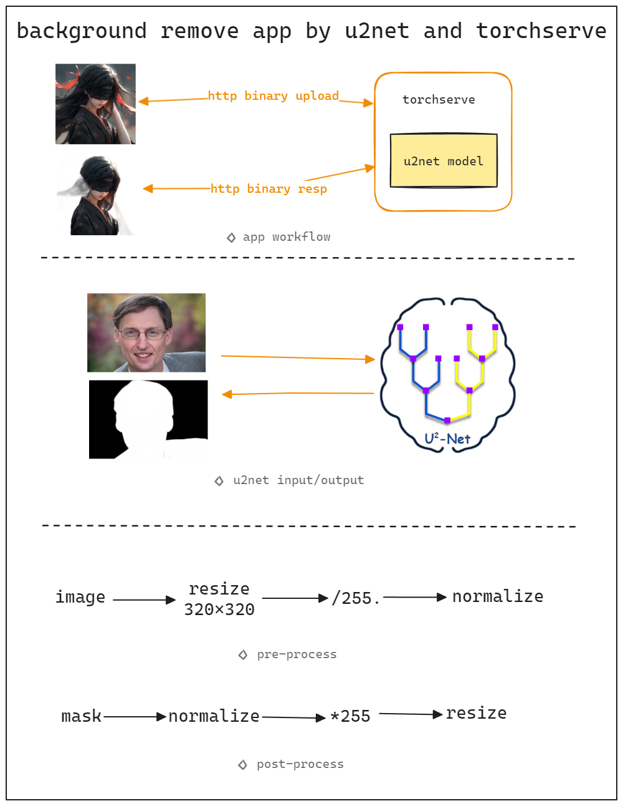

## details

## install && run
```bash
# step 1. install torchserve
https://pytorch.org/serve/getting_started.html

# step 2. git clone the rep.
git clone https://github.com/sqjb/u2net-background-removal

# step 3. goto u2net repo and download pre-trained u2net.pth
https://github.com/NathanUA/U-2-Net.git

# step 4. create u2net.mar mode file
torch-model-archiver --model-name u2net --version 1.0 --model-file ./u2net/u2net.py --extra-files ./u2net/layer.py --serialized-file u2net/u2net.pth --export-path model_store --handler ./u2net/handler.py -f

# step 5. start torchserve and load u2net.mar
torchserve --start --ncs --model-store model_store --models u2net.mar

# step 6. use curl command to test
curl http://127.0.0.1:8080/predictions/u2net -F 'data=@test.jpg' -o r.png
```

## issues
#### 1. image list in single http request for batch inference
seems torchserve not support yet